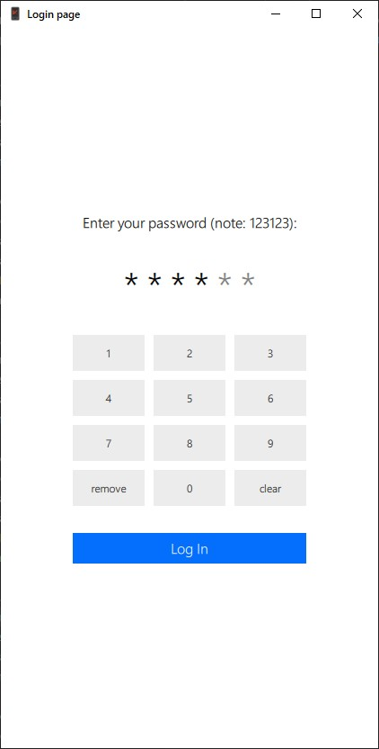

# QML_7_1. Страничка для входа с цифровым паролем

## Функционал

Родительский элемент хранит значение требуемого пароля и текущее значение поля ввода. Для наглядности, пароль пишется в строке.

При вводе цифры символы, отвечающие за шифр пароля, перекрашиваются в более тёмный цвет. Пользователю доступна возможность полностью очистить поле с помощью кнопки `clear` и удалить последний символ с помощью кнопки `remove`.

При попытке войти сравнивается требуемый пароль со значением ввода, соответствующее сообщение будет выведено в кнопке.

## Демонстрация

### Начальный вид

<table>
    <tr>
        <td></td>
        <td></td>
    </tr>
</table>

### Сообщения при попытке входа

<table>
    <tr>
        <td></td>
        <td></td>
    </tr>
</table>